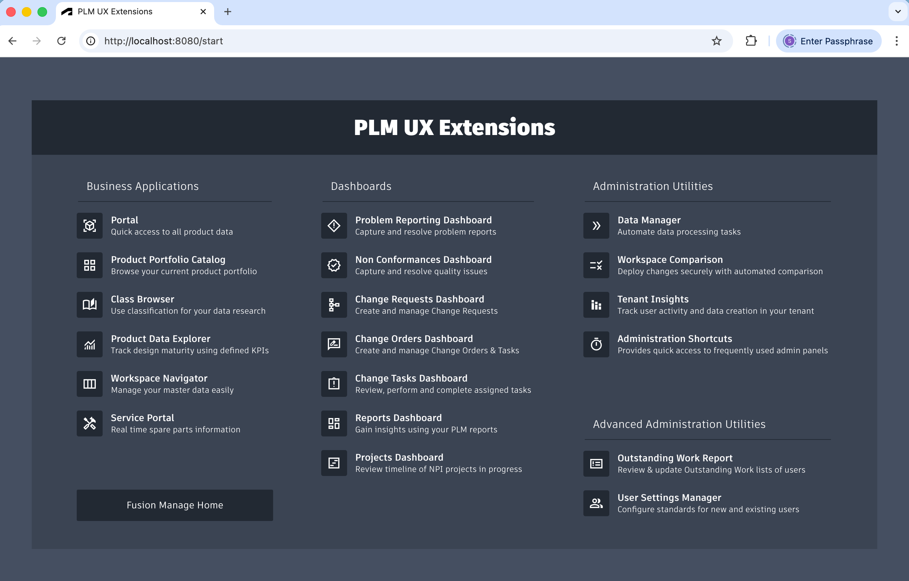
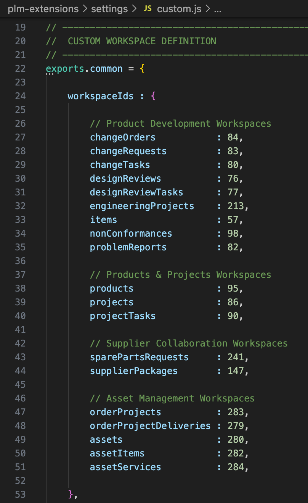
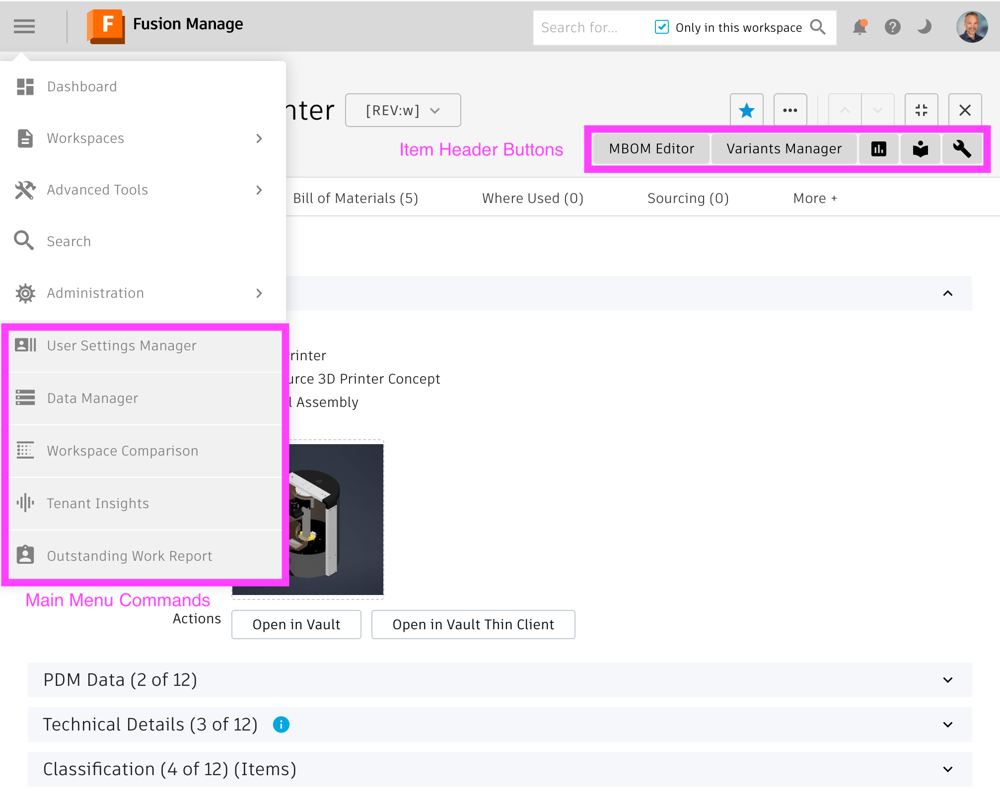

# plm-extensions
> **IMPORTANT SETUP CHANGES**
>
> Since the release of January 2026, connection settings are no longer managed in the settings file, but in file environment.js. Additionally, custom settings can be applied much easier now as custom settings are managed in dedicated files, separated from the standard settings file. These changes make it easier to deploy this solution when using multiple environments while staying up-to-date. See the new section with Setup Instructions in this readme for details. 
> To reduce deployment efforts, the applications now use a common definition of workspace IDs and a standard BOM view for BOM tree navigation. This commonly used BOM view named 'Tree Navigator' must be created before and should contain the following columns only: Descriptor, Number and Quantity. New tenants will contain this BOM view in future.

## Introduction
These User Experiences based on Fusion Manage improve adoption of your PLM solution and increase end user efficiency. This package provides dedicated applications running on top of Fusion Manage and Autodesk Platform Services. The applications use the REST APIs of Fusion Manage to retrieve and update PLM data, but do not store any data outside of PLM. All applications included in this extensions package are hosted by a single web server to keep deployment effort at a mininum. Configuration settings enable adjustments of the applications and alignment with individual tenant configurations. This source code is provided as is for free and can be adjusted, integrated, extended, reused and shared as needed.

This is <ins>not an official Autodesk product</ins>. Instead, the solutions listed below are provided by a custom built server based on node.js connecting to Fusion Manage tenants using REST APIs. This server must be hosted individually. It can be downloaded and hosted on premise, but it can also hosted in the cloud to stay up-to-date easily. When using a cloud based platform like AWS, Azure or Google, it can be deployed directly from Github after forking this repository. See the following 10 minutes video for a quick introduction of the solutions and its setup using Google Cloud Run: https://youtu.be/9EtlCDzmWWE.

Disclaimer: In any case all source code of this solution is of "work in progress" character. Neither of the contributors nor Autodesk represent that theses code samples are reliable, accurate, complete, or otherwise valid. Accordingly, those configuration samples are provided “as is” with no warranty of any kind and you use the applications at your own risk. 

## Setup Instructions
Pefrorm the steps listed below to run this server on your local system for testing purposes. For an advanced setup using Google Cloud, see this video: https://youtu.be/9EtlCDzmWWE
<ol>
<li>Download and unzip this package from Github</li>
<li>Create an application at aps.autodesk.com of type "Desktop, Mobile, Single-Page App" and set its callback URL to http://localhost:8080/callback (the APS APIs being used are free of charge).</li>
<li>Whitelist this application's clientID in your tenant's General Settings</li>
<li>Using a text-editor, open file environment.js and provide the following information: tenant and clientId</li>
<li>Install node.js from https://nodejs.org/en/download/current</li>
<li>Open a command prompt and navigate to the unzipped folder of step #1</li>
<li>In this command prompt, download required node modules by running **npm install**</li>
<li>Launch the server from the command prompt by running **npm start**</li>
<li>In your browser, navigate to the server's landing page at http://localhost:8080</li>
<li>In this landing page, you will find the list of available applications as well as additional setup instructions if required</li>
</ol>

### Launching Applications ###
Once the server is available, you can launch the applications from the landing page (http://localhost:8080). You can also access most applications with the common Start Menu (http://localhost:8080/start). This menu provides access to all applications not requiring a context item in PLM:

### Environment Variables ###
The UX server requires few information to be provided in the environment file(s): tenant name, Client ID and so on. When hosting this server in the cloudd, you may prefer to use environment variables instead. See the end of file <a href="https://github.com/dickmans/plm-extensions/tree/main/environment.js" target="_blank">environment.js</a> for the list of supported environment variables.

### Workspace IDs List ###
This package has been aligned with the default tenant configuration of Fusion Manage as much as possible. Anyway, you should review the list of Workspace IDs being used by the server. This list of IDs is defined at beginning of <a href="https://github.com/dickmans/plm-extensions/tree/main/settings/custom.js" target="_blank">/settings/custom.js</a> as shown below. Update the numbers if needed and skip the workspaces that do not exist in your tenant.

### Changing Configuration Settings
The file <a href="https://github.com/dickmans/plm-extensions/tree/main/settings.js" target="_blank">settings.js</a> contains configuration settings for the UX server and all its applications. While these settings can be changed - and even must be changed for some applications - it is recommended to not modify this settings.js file directly. Instead, it is recommended to provide the custom configuration settings in file <a href="https://github.com/dickmans/plm-extensions/tree/main/settings/custom.js" target="_blank">/settings/custom.js</a>. This file is supposed to only contain the settings being changed, not the full list of all settings. It provides a template for the most commonly changed settings, but you can also copy further settings from settings.js to this file to overwrite the default settings. See the instructions in file custom.js for details.

### Multiple Environments
If the UX server should be used with multiple Fusion Manage tenants, you can use multiple environment files in folder /environments and multiple custom setting files in folder /settings. 

For each tenant, create a copy of file <a href="https://github.com/dickmans/plm-extensions/tree/main/environments/template.js" target="_blank">/environments/template.js</a> in the same folder and give it a unique name (ie. use the tenant's name). In each of these environment files, you can now define a specific tenant and Client ID to be used. Now, you can launch the server with a specific environment file by passing the given filename when starting the server. For example, if file /environments/adsktenant.js should be used, launch the server with this command:
**npm start adsktenant**. In this case, the contents of the standard environment.js file will be ignored.

If an environment also requires a specific custom setting file, create a copy of file <a href="https://github.com/dickmans/plm-extensions/tree/main/settings/custom.js" target="_blank">/settings/custom.js</a> in the settings folder. The environment file defines the custom settings file to use in exports.settings (with custom.js being the default value). If you want to use another file than custom.js, you must therefore update the given reference in exports.settings of your environment file. 

### Upgrading From Previous Releases ###
If you used the UX extensions in the past with a single settings.js file - without the environment.js file - please perform the following steps:
<ol>
<li>Create a backup copy of your settings.js file</li>
<li>Copy the connection settings at beginning of settings.js to environment.js. Note that the syntax of the lines has changed, copy the values only! </li>
<li>Compare your backup copy of settings.js with file <a href="https://github.com/dickmans/plm-extensions/tree/main/settings-previous-releases.js" target="_blank">settings-previous-releases.js</a> to identify the configuration changes of the past releaase.</li>
<li>Copy these custom setting values to file <a href="https://github.com/dickmans/plm-extensions/tree/main/settings/custom.js" target="_blank">/settings/custom.js</a>. Do not copy all settings, only copy the ones being modified. When doing so, keep in mind that the structure of the settings might have changed. For examples, the former exports.config got renamed to exports.applications - and there can be changes on lower levels as well, depending on the version of your previous environment.</li>
</ol>

## Optional Chrome Extension
Accessibility of the UX extensions can be further improved by installing the Chrome Extension contained in folder <a href="https://github.com/dickmans/plm-extensions/tree/main/chrome" target="_blank">/chrome</a>. This Chrome Extension can be use with Google Chrome and Microsoft Edge only and must be installed on each client. 

Once installed, additional controls will be added to the standard Fusion Manage user interface dynamically, based on the server settings. Administrators will find the custom admin utilities in the main menu while end users will find new buttons in the item header for direct access to matching UX applications. See the PLM UX server's landing page for details about the setup and configuration of these capabilities.

 
 

## End User Applications Included
The following extensions are included in this package. Each application can be accessed by a dedicated endpoint or by using the [Start Menu](https://youtu.be/ImnXV0HF3PA). This menu can be configured in the settings file to remove unwanted applications, rename existing ones or just to change the sequences of entries.

| &nbsp; | &nbsp; |
| -- | -- |
|  | **PLM Portal** Provides quick access to latest product data in PLM using a very basic frontend for casual users, working well on tablets. See video at https://youtu.be/tM8why6ybAU. |
|  | **Product Portfolio Catalog** The sales team can browse the Product Portfolio by Product Categories and Product Lines and retrieve latest product data including technical specification, documentation and Bill of Materials. See video at (https://youtu.be/hroRMjZzueQ). |
|  | **Workspace Navigator** All contributors and decison makers now can manage multiple records easily; mass edit & compare properties based on the user's workspace views, bookmarks & recently viewed records. See video at https://youtu.be/jHBkAuEh32g. |
|  | **Mobile Client** Have PLM with you all the time in your pocket. Visualize product data, enrich data, manage documents, perform workflow actions and trigger new processes whenever needed. |
|  | **Process Dashboard** Manufacturing, Services, Suppliers and Customers can be involved in business processes easily with this application focussing on management of one defined business process only (i.e. capturing Problem Reports). See video at https://youtu.be/VkxJXRQ9Pmg. |
|  | **Product Data Explorer** Manufacturing, Services, Suppliers and Customers can be involved in business processes easily with this application focussing on management of one defined business process only (i.e. to capture PRs). See video at https://youtu.be/hLNB3z_lp2k. |
|  | **Reports Dashboard** Provides (managers) easy access to real time reports of PLM. This dashboard combines multiple graphic reports and table reports. The latter ones enable to open the given records in PLM directly. See video at https://youtu.be/quNaLQLAT3Q. |
|  | **Projects Dashboard** (Project) Managers can track progression of all projects in a single, predefined dashboard. |
|  | **Manufacturing BOM Editor** Process engineers can transform an Engineering BOM to a Manufacturing BOM with ease using this editor. It enables restructuring and addition of components even for multiple, site-specific MBOMs. See video at https://youtu.be/qVhhKlrf1S0. |
|  | **Service BOM Editor** Users can define Spare Parts and Service Kits easily based on an Engineering BOM and define dedicated Service Offerings on top. See video at https://youtu.be/zVnsrQyO-1o. |
|  | **Variants Manager** Engineers and Product Managers can define variants of an existing product design. This helps creating BOM variants based on color, material or other properties with ease. See video at https://youtu.be/v6ZZN3Xo-BM. |
|  | **Classification Browser** Engineers can use item classification data to easily browse for similar components. This helps increasing reuse of existing items and thus reducing development efforts. |
|  | **Design Reviews Portal** This portal can involve customers in the review process. Driven by Design Review processes in PLM, it provides feedback & file sharing capabilities. Markups can be used to create corrective Design Review Tasks. See video at https://youtu.be/AU--qJIMmlE. |
|  | **Change Impact Analysis** Change managers & and approvers can reveal insights about the impact of changes using this dashboard. While navigating the affected items, impact on BOM, files and related items can be reviewed before approval. See video at https://youtu.be/6A9ZNCxqRKg. |
|  | **Service Portal** Service teams get online access to latest product data and spare parts information. Users can navigate the BOM, download documentation and create Spare Part Requests & Problem Reports in PLM. See video at https://youtu.be/VV68HAJaeF4. |

 
 

## Administration Utilities Included
Reduce deployment and administration efforts with the following utilities addressing the needs of administrators specifically. The utilities require administration permission, in some cases even a specific APS application type is needed.

| &nbsp; | &nbsp; |
| -- | -- |
| **Data Manager** When existing workspaces with data get modified or when data gets imported, administrators often have to cleanup and adjust the data afterwards. With this utlity, such changes can be performed in batch to improve data quatliy. See video at https://youtu.be/hL4UblHbXw0.|  |
| **Tenant Insights** Administrators can track user activity and data modifications of a tenant using this graphic dashboard. It uses the standard system log entries and requires system admin privileges to run. See video at https://youtu.be/WZXGfDKGRHY. |  |
| **Workspace Comparison** Deploy changes across multiple tenants with confidence with this automated comparison of selected workspaces. See video at https://youtu.be/llQtsclH-L0. |  |
| **Administration Shortcuts** Use this dashboard to quickly navigate to tenant administration capabilities including workspace configuration, picklist setup, script editing and role definition. See video at https://youtu.be/D_qFX90CGAI. |  |
| **Outstanding Work Report** Review the outstanding work lists of other users and take action if needed to keep the processing going. See video at https://youtu.be/zUIfiiAVwVQ |  |
| **User Settings Manager** Set default settings for your tenant users to provide a better user experience. Share workspace views, configure the dashboard charts and set the color theme to drive user adoption. See video at https://youtu.be/hJjxoovwbS8. |  |
