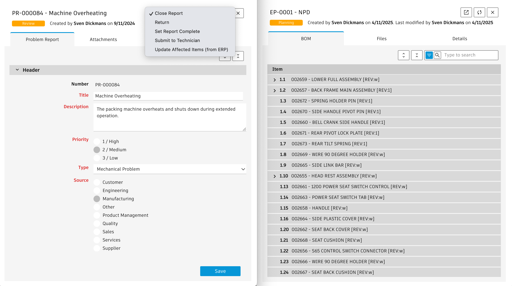

# plm-extensions
## New User Experiences based on Fusion Manage
Improve adoption of your PLM solution and increase end user efficiency with these dedicated applications running on top of Fusion Manage and Autodesk Platform Services. All  applications included in this extensions package are hosted by a single web server to keep deployment effort at a mininum. A single settings file enables adjustments of the applications and alignment with individual tenant configurations. All applications can be displayed in light and dark theme.

Disclaimer: In any case all source code of this solution is of "work in progress" character. Neither of the contributors nor Autodesk represent that theses code samples are reliable, accurate, complete, or otherwise valid. Accordingly, those configuration samples are provided “as is” with no warranty of any kind and you use the applications at your own risk. 

> **Important Notice**
> Since the release of July 2024, you must use an Autodesk Platform Services application of type "Desktop, Mobile, Single-Page App" to enable the new authentication based on PKCE. If not done yet, please create such an app and update your clientID in settings.js (clientSecret is not required any longer).

## Application Overview
The following extensions are included in this package. Each application can be accessed by a dedicated endpoint but also by using the [integrated menu](https://youtu.be/ImnXV0HF3PA). This given menu can be configured in the landing page while the list of available endpoints / applications is defined in file routes/landing.js

### PLM Portal

Provide quick access to latest product data in PLM using a very basic frontend for casual users, working well on tablets
[See Video](https://youtu.be/6A9ZNCxqRKg)

### Product Portfolio Catalog
The sales team can browse the Product Portfolio by Product Categories and Product Lines and retrieve latest product data including technical specification, documentation and Bill of Materials
[See Video](https://youtu.be/hroRMjZzueQ)
 
 -->

- Change Impact Analysis [Video](https://youtu.be/6A9ZNCxqRKg)
- Class Browser
- Data Manager [Video](https://youtu.be/hL4UblHbXw0)
- Design Review Portal [Video](https://youtu.be/AU--qJIMmlE)
- MBOM Editor [Video](https://youtu.be/qVhhKlrf1S0)
- Mobile Client
- Outstanding Work Report [Video](https://youtu.be/zUIfiiAVwVQ)
- PLM Portal [Video](https://youtu.be/tM8why6ybAU)
- Process Dashboard [Video](https://youtu.be/VkxJXRQ9Pmg)
- Product Portfolio Catalog [Video](https://youtu.be/hroRMjZzueQ)
- Product Data Explorer [Video](https://youtu.be/hLNB3z_lp2k)
- Projects Dashboard
- Reports Dashboard [Video](https://youtu.be/quNaLQLAT3Q)
- Service BOM Editor [Video](https://youtu.be/zVnsrQyO-1o)
- Services Portal [Video](https://youtu.be/VV68HAJaeF4)
- Tenant Inisghts [Video](https://youtu.be/WZXGfDKGRHY)
- User Settings Manager [Video](https://youtu.be/hJjxoovwbS8)
- Variants Manager [Video](https://youtu.be/v6ZZN3Xo-BM)
- Workspace Comparison [Video](https://youtu.be/llQtsclH-L0)
- Workspaces Navigator [Video](https://youtu.be/jHBkAuEh32g)
- Administration Shortcuts [Video](https://youtu.be/D_qFX90CGAI)

<!--  -->

The release of May 2025 added a main menu feature, making the various applications easier to use. See this [Video](https://youtu.be/ImnXV0HF3PA). This menu can be configured (and disabled) with the variable export.menu in the settings file.