# plm-extensions
## User Experiences based on Fusion Manage
Improve adoption of your PLM solution and increase end user efficiency with these dedicated applications running on top of Fusion Manage and Autodesk Platform Services. These addon applications use the REST APIs of Fusion Manage to retrieve and update PLM data, but do not store any data outside of PLM. 

All applications included in this extensions package are hosted by a single web server to keep deployment effort at a mininum. A single settings file enables adjustments of the applications and alignment with individual tenant configurations. All applications can be displayed in light and dark theme. 

Disclaimer: In any case all source code of this solution is of "work in progress" character. Neither of the contributors nor Autodesk represent that theses code samples are reliable, accurate, complete, or otherwise valid. Accordingly, those configuration samples are provided “as is” with no warranty of any kind and you use the applications at your own risk. 

> **Important Notice**
> Since the release of July 2024, you must use an Autodesk Platform Services application of type "Desktop, Mobile, Single-Page App" to enable the new authentication based on PKCE. If not done yet, please create such an app and update your clientID in settings.js (clientSecret is not required any longer).

## Introduction and Setup
This package is not an official Autodesk product and the features listed below are not included in a standard Autodesk solution. Instead, they are made available by running a node.js based server that connects to any Fusion Manage tenant using the given REST APIs. This server must be hosted on customer infrastructure, but it can also be deployed directly from this repository using a cloud based platform like AWS, Azure or Google. 

See the following video for a quick introduction and specifically the setup using Google Cloud Run: https://youtu.be/9EtlCDzmWWE.

This source code is provided as is for free and can be adjusted, integrated, extended, reused and shared as needed.

## End User Applications Included
The following extensions are included in this package. Each application can be accessed by a dedicated endpoint but also by using the [integrated menu](https://youtu.be/ImnXV0HF3PA). This given menu can be configured in the landing page while the list of available endpoints / applications is defined in file routes/landing.js

### PLM Portal
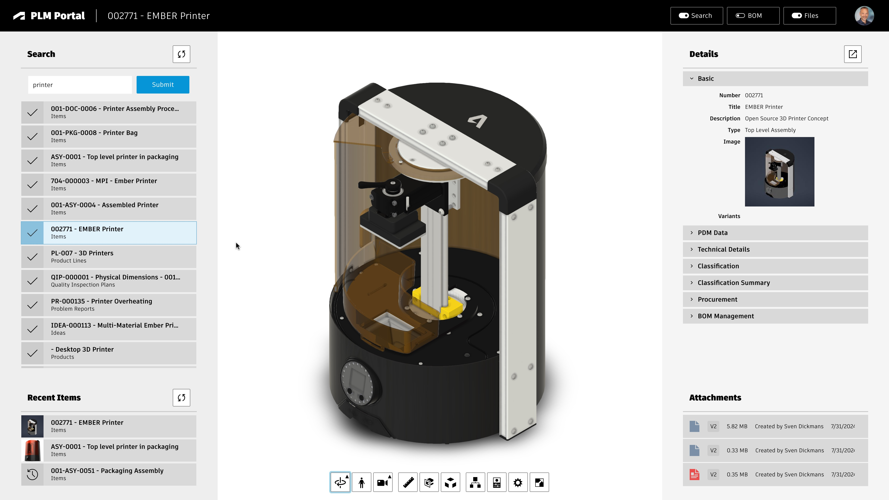
Provide quick access to latest product data in PLM using a very basic frontend for casual users, working well on tablets. See video at https://youtu.be/tM8why6ybAU.

### Product Portfolio Catalog
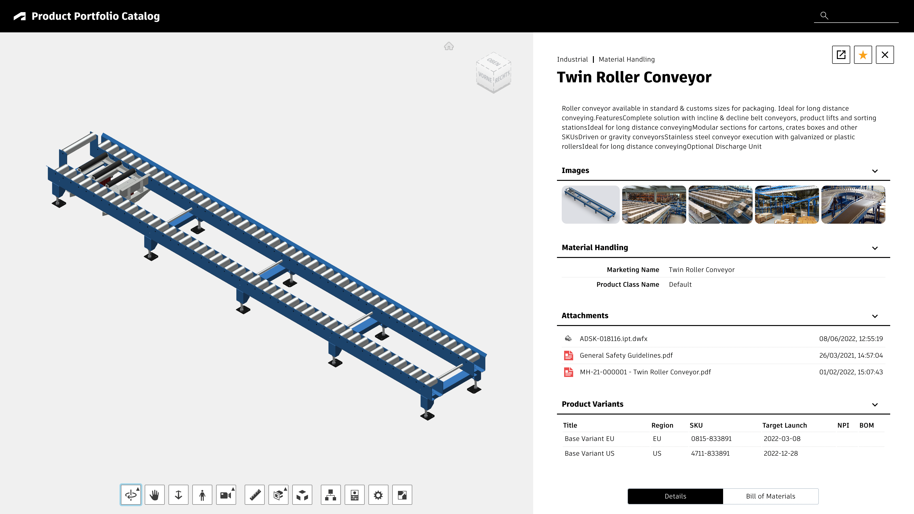
The sales team can browse the Product Portfolio by Product Categories and Product Lines and retrieve latest product data including technical specification, documentation and Bill of Materials. See video at (https://youtu.be/hroRMjZzueQ).

### Workspace Navigator
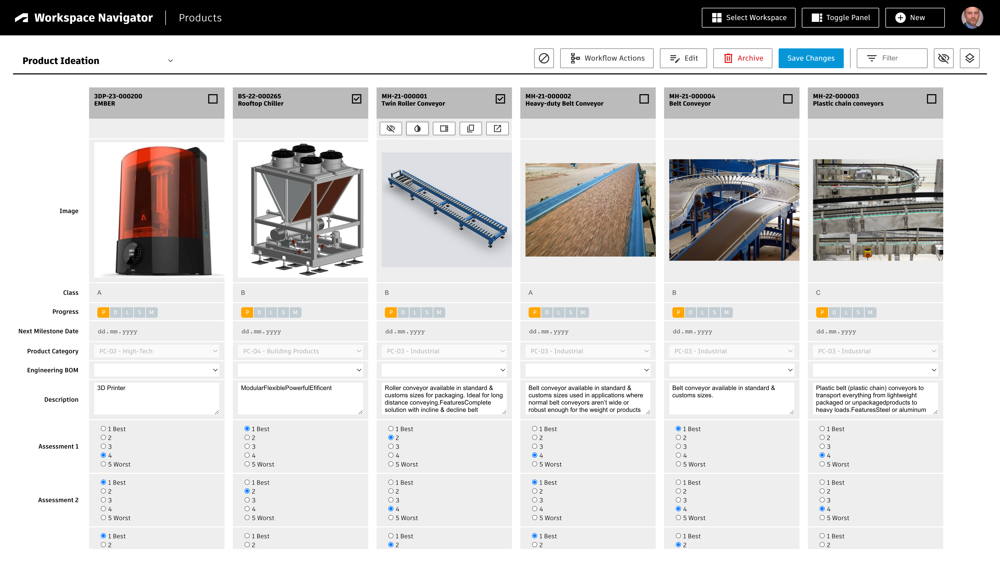
All contributors and decison makers now can manage multiple records easily; mass edit & compare properties based on the user's workspace views, bookmarks & recently viewed records. See video at https://youtu.be/jHBkAuEh32g.

### Mobile Client
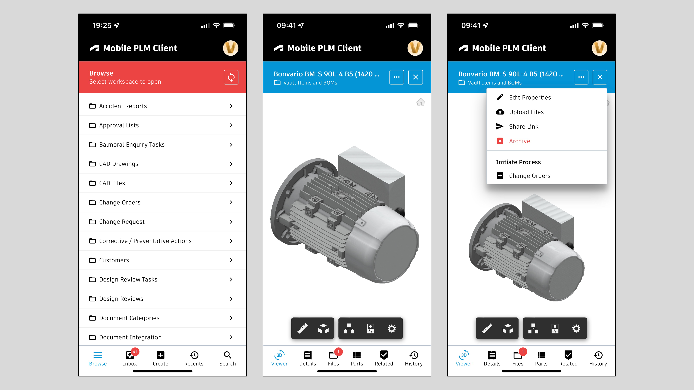
Have PLM with you all the time in your pocket. Visualize product data, enrich data, manage documents, perform workflow actions and trigger new processes whenever needed.

### Process Dashboard
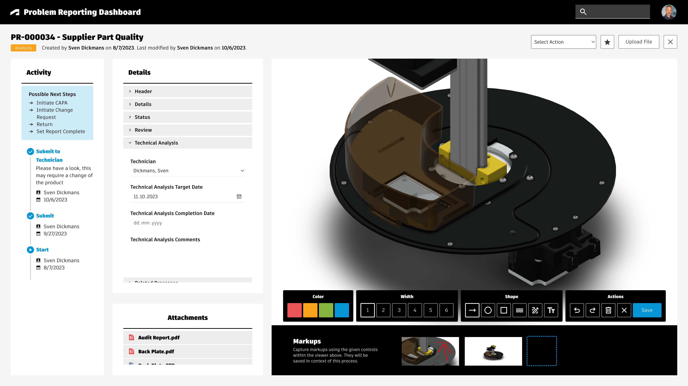
Manufacturing, Services, Suppliers and Customers can be involved in business processes easily with this application focussing on management of one defined business process only (i.e. to capture PRs). See video at https://youtu.be/VkxJXRQ9Pmg.

### Product Data Explorer
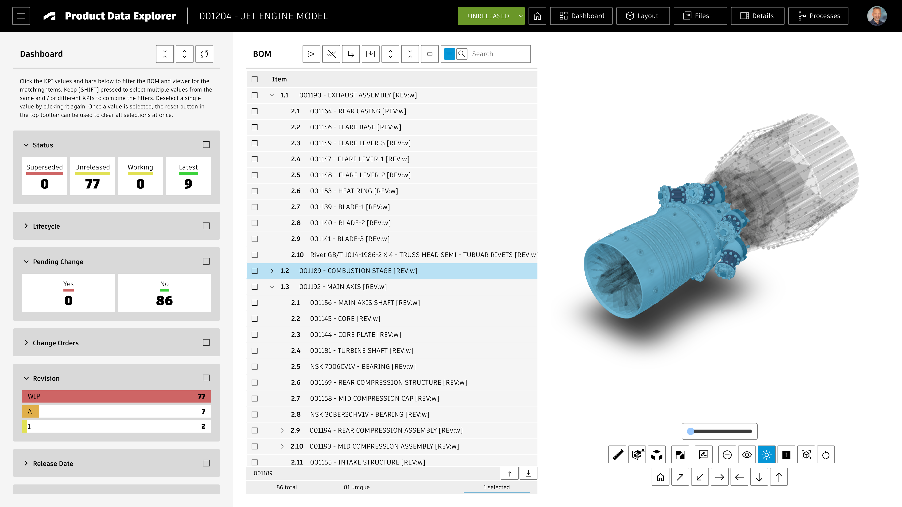
Even Non-Engineers now can review the design using dynamic KPIs driving charts and visual filtering & highlighting. In addition, product data can be enriched using (mass) edit capabilites. See video at https://youtu.be/hLNB3z_lp2k.

### Reports Dashboard
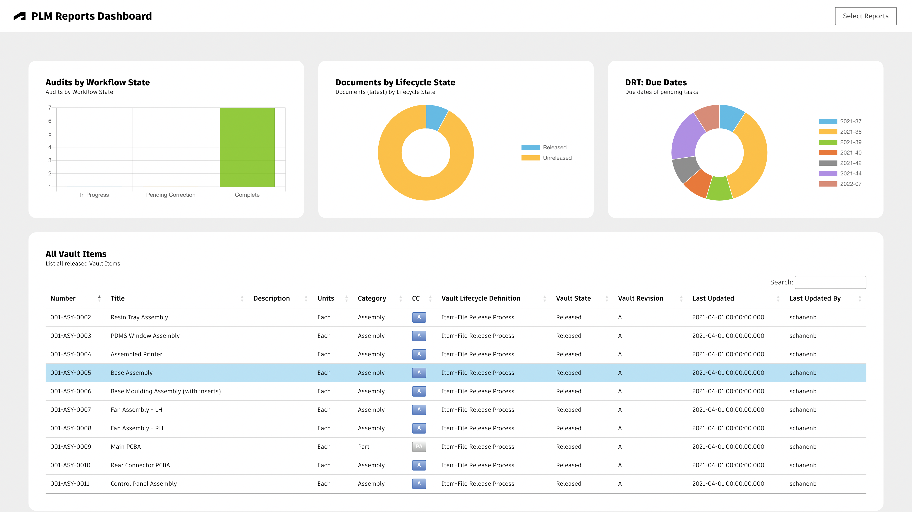
Provides (managers) easy access to real time reports of PLM. This dashboard combines multiple graphic reports and table reports. The latter ones enable to open the given records in PLM directly. See video at https://youtu.be/quNaLQLAT3Q.

### Projects Dashboard
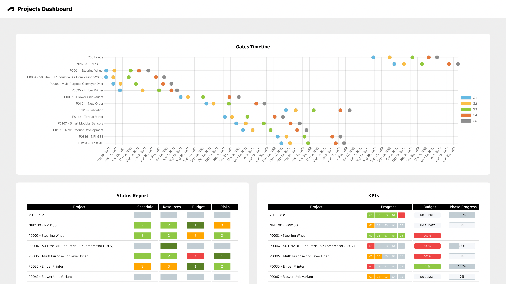
(Project) Managers can track progression of all projects in a single, predefined dashboard.

### Manufacturing BOM Editor
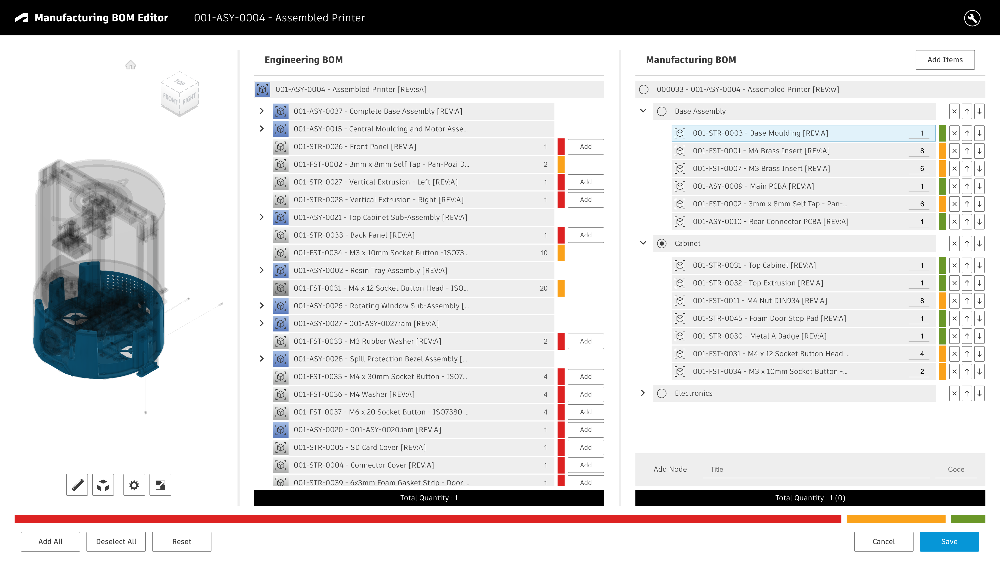
Process engineers can transform an Engineering BOM to a Manufacturing BOM with ease using this editor. It enables restructuring and addition of components even for multiple, site-specific MBOMs. See video at https://youtu.be/qVhhKlrf1S0.

### Service BOM Editor
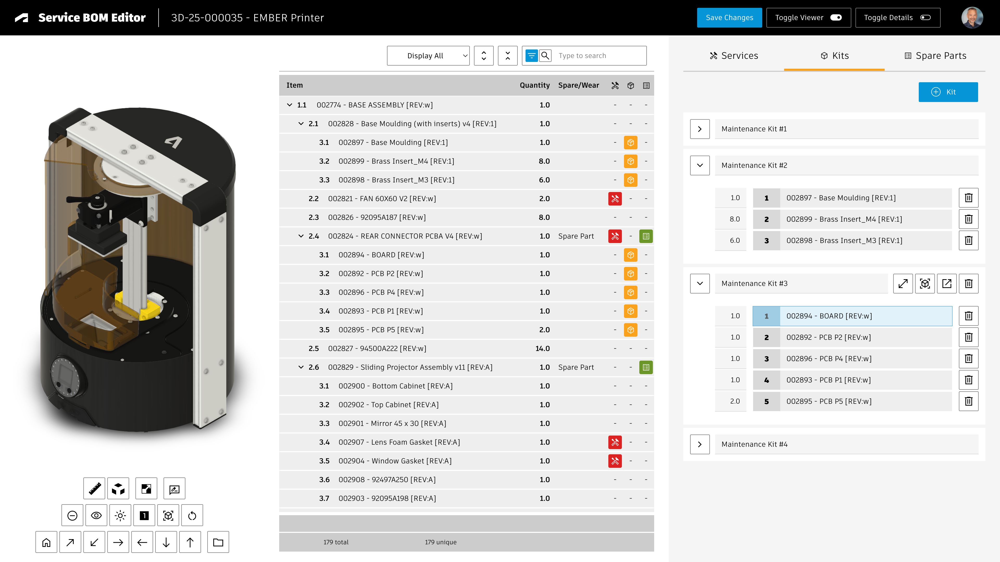
Users can define Spare Parts and Service Kits easily based on an Engineering BOM and define dedicated Service Offerings on top. See video at https://youtu.be/zVnsrQyO-1o.

### Variants BOM Editor
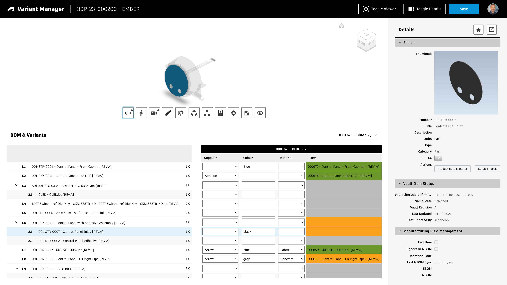
Engineers and Product Managers can define variants of an existing product design. This helps creating BOM variants based on color, material or other properties with ease. See video at https://youtu.be/v6ZZN3Xo-BM.

### Classification Browser
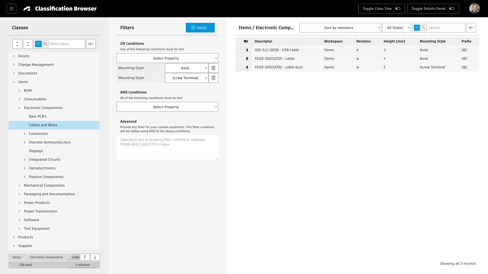
Engineers can use item classification data to easily browse for similar components. This helps increasing reuse of existing items and thus reducing development efforts.

### Design Reviews Portal

This portal can involve customers in the review process. Driven by Design Review processes in PLM, it provides feedback & file sharing capabilities. Markups can be used to create corrective Design Review Tasks. See video at https://youtu.be/AU--qJIMmlE.

### Change Impact Analysis
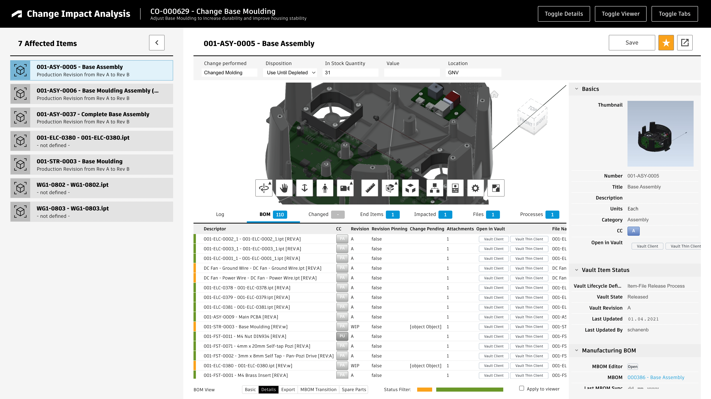
Change managers & and approvers can reveal insights about the impact of changes using this dashboard. While navigating the affected items, impact on BOM, files and related items can be reviewed before approval. See video at https://youtu.be/6A9ZNCxqRKg.

### Service Portal
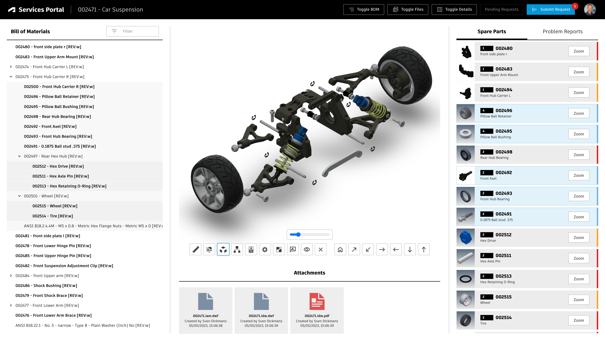
Service teams get online access to latest product data and spare parts information. Users can navigate the BOM, download documentation and create Spare Part Requests & Problem Reports in PLM. See video at https://youtu.be/VV68HAJaeF4.

## Administration Utilities Included
Reduce deployment and administration efforts with the following utilities addressing the needs of administrators specifically. The utilities require administration permission, in some cases even a specific APS application type is needed.

### Data Manager
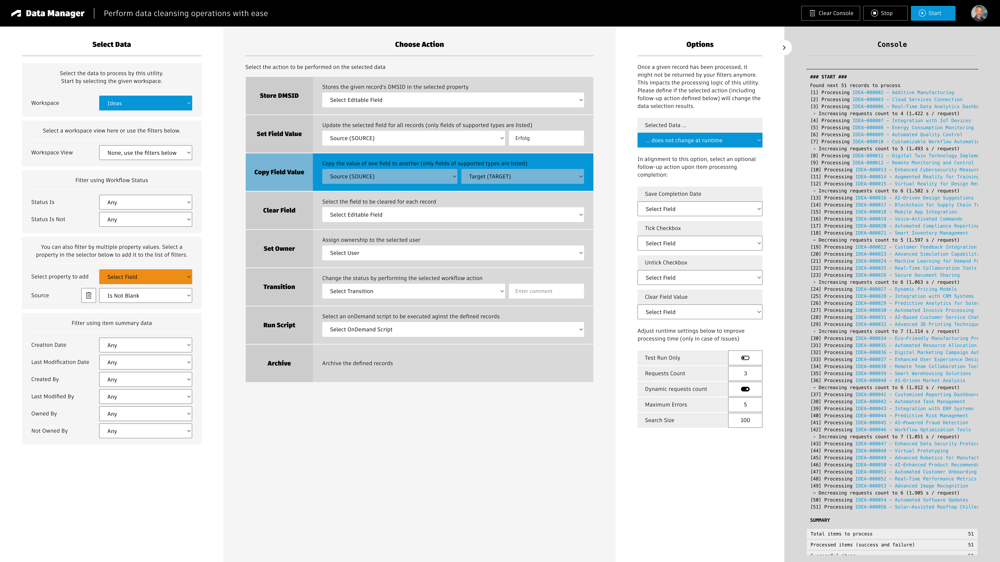
When existing workspaces with data get modified or when data gets imported, administrators often have to cleanup and adjust the data afterwards. With this utlity, such changes can be performed in batch to improve data quatliy. See video at https://youtu.be/hL4UblHbXw0.

### Tenant Insights
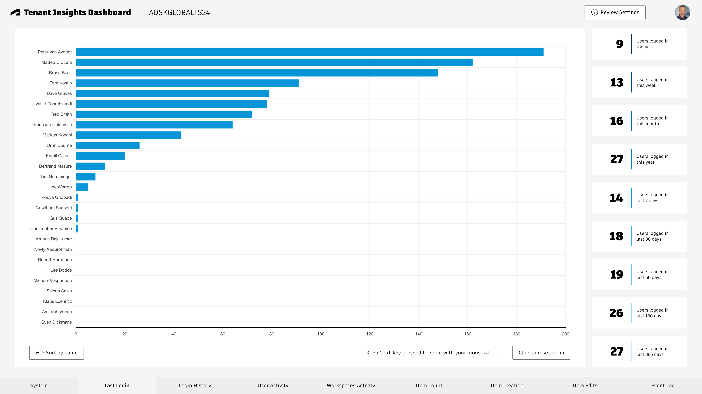
Administrators can track user activity and data modifications of a tenant using this graphic dashboard. It uses the standard system log entries and requires system admin privileges to run. See video at https://youtu.be/WZXGfDKGRHY.

### Workspace Comparison
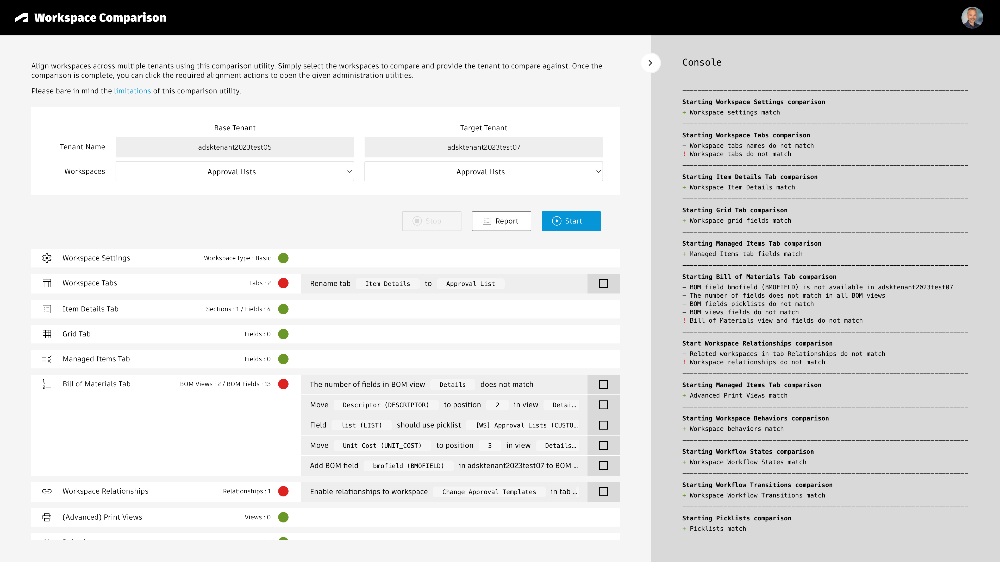
Deploy changes across multiple tenants with confidence with this automated comparison of selected workspaces. See video at https://youtu.be/llQtsclH-L0.

### Administration Shortcuts
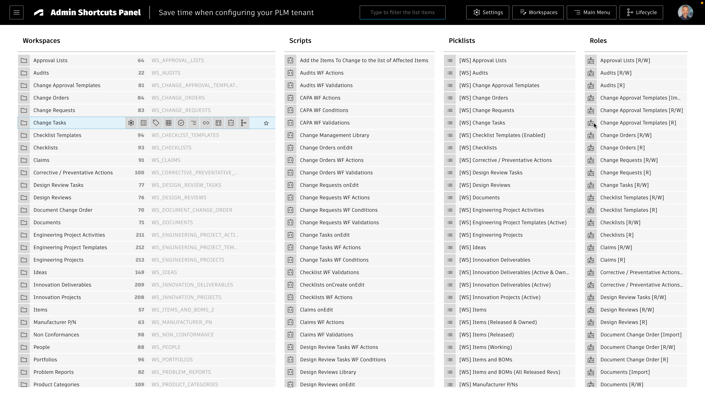
Use this dashboard to quickly navigate to tenant administration capabilities including workspace configuration, picklist setup, script editing and role definition. See video at https://youtu.be/D_qFX90CGAI.

### Outstanding Work Report
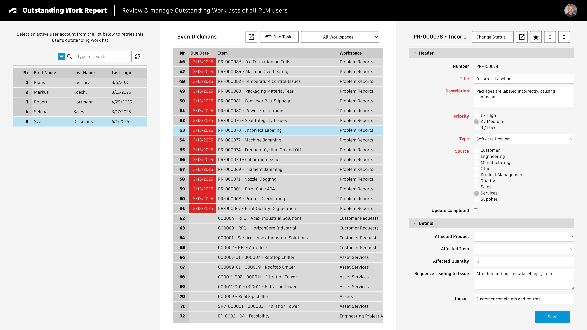
Review the outstanding work lists of other users and take action if needed to keep the processing going. See video at https://youtu.be/zUIfiiAVwVQ

### User Settings Manager
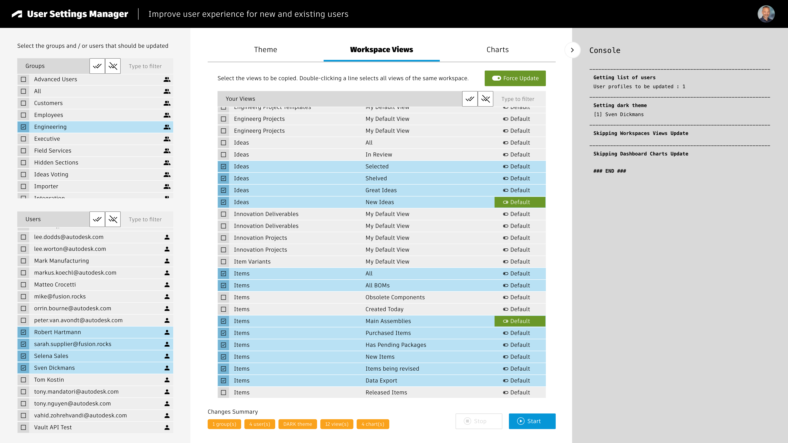
Set default settings for your tenant users to provide a better user experience. Share workspace views, configure the dashboard charts and set the color theme to drive user adoption. See video at https://youtu.be/hJjxoovwbS8.